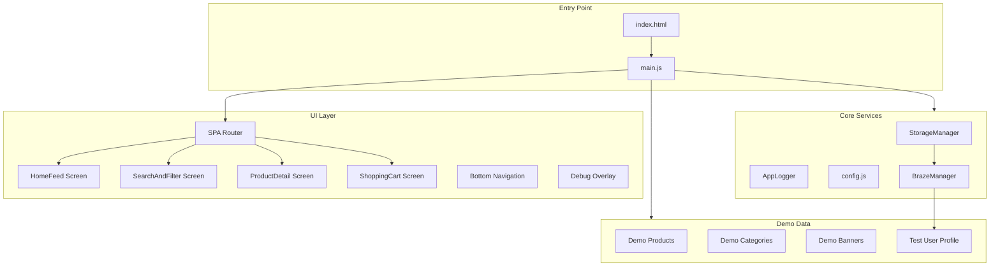

# UniqueItemMarketplace SPA Implementation Plan

## Context

- **Current state:** App directory is empty (greenfield). Only [.cursor/design/design.json](.cursor/design/design.json) and rules exist.
- **Design:** UniqueItemMarketplace with red primary (#C62828), 5-tab bottom nav, 4 main screens (HomeFeed, SearchAndFilter, ProductDetail, ShoppingCart).
- **Constraints:** All content must be driven by demo data objects; no static markup except logos/fixed text. Braze-first logic, iPhone frame (390x844px), StorageManager, AppLogger required.

---

## Architecture Overview




---

## 1. Project Structure

```
app/
├── index.html
├── package.json
├── tailwind.config.js
├── vercel.json
├── .gitignore
├── README.md
├── config/
│   └── config.js
├── css/
│   └── styles.css
├── js/
│   ├── main.js
│   ├── services/
│   │   ├── storage-manager.js
│   │   ├── app-logger.js
│   │   ├── braze-manager.js
│   │   └── router.js
│   ├── data/
│   │   └── demo-data.js
│   └── components/
│       ├── bottom-nav.js
│       ├── header.js
│       ├── product-card.js
│       ├── category-icon.js
│       ├── promo-carousel.js
│       ├── product-grid.js
│       └── debug-overlay.js
└── screens/
    ├── home-feed.js
    ├── search-filter.js
    ├── product-detail.js
    └── shopping-cart.js
```

---

## 2. Design System Integration

Map [design.json](.cursor/design/design.json) tokens into CSS variables in `:root`:


| design.json       | CSS Variable                  | Value          |
| ----------------- | ----------------------------- | -------------- |
| primary           | `--color-primary`             | #C62828        |
| secondary         | `--color-secondary`           | #F8F8F8        |
| text_main         | `--color-text-main`           | #333333        |
| text_muted        | `--color-text-muted`          | #888888        |
| accent_discount   | `--color-accent-discount`     | #FF5252        |
| border            | `--color-border`              | #EEEEEE        |
| spacing.base      | `--spacing-base`              | 8px            |
| container_padding | `--container-padding`         | 16px           |
| border_radius.*   | `--radius-small/medium/large` | 4px, 8px, 12px |


Merge with layout rules: `--phone-w: 390px`, `--phone-h: 844px`, `--safe-t: 47px`, `--safe-b: 34px`.

---

## 3. Core Infrastructure

### 3.1 StorageManager ([localstorage.mdc](.cursor/rules/localstorage.mdc))

- Singleton with `ar_app`_ prefix
- Methods: `set()`, `get()`, `remove()`, `clearSession()`
- Keys: `ar_app_user_session`, `ar_app_current_route`, `ar_app_cart`, `ar_app_coupons_applied`, `ar_app_braze_init_status`, `ar_app_debug_mode`

### 3.2 AppLogger ([logging.mdc](.cursor/rules/logging.mdc))

- Singleton with `getLogs()` (last 50), `DEBUG_MODE` from StorageManager
- Categories: UI, SDK, AUTH, STORAGE, SYSTEM
- ERROR logs → Braze Custom Event `App_Error`

### 3.3 config.js

- Braze API key and endpoint (env vars or placeholder)
- `app_version`, `platform: "web_mobile_frame"`

### 3.4 Demo Data ([braze.mdc](.cursor/rules/braze.mdc) §7)

- **Test user:** `{ name, email, external_id }` for `braze.changeUser()`
- **Products:** Array with id, title, price, originalPrice, discount, grade, status, thumbnail, seller, description
- **Categories:** 8 items (2x4 grid) with icon/image and label
- **Banners:** 3+ promo items for carousel (16:7 aspect)
- **Coupons:** 2–3 demo coupons for cart

---

## 4. Braze Integration ([braze.mdc](.cursor/rules/braze.mdc))

- **braze-manager.js:** Init SDK, `changeUser()` on load if `ar_app_user_id` exists
- **Safety:** All calls wrapped in `if (window.braze) { ... }`
- **IAM:** `subscribeToInAppMessage` → render inside `#phone-frame`
- **Content Cards:** `subscribeToContentCardsUpdates` → map banners to PromoBannerCarousel
- **Events:** `Navigation - Tab Switched`, `Promotion - Viewed`, `Product - Viewed`, `Cart - Item Added`, etc.
- **Debug Overlay:** Outside phone frame, header link; shows user profile (External ID, Braze ID, contact) + last 20 events from AppLogger

---

## 5. SPA Router

- Hash-based routing: `#/`, `#/store`, `#/search`, `#/product/:id`, `#/cart`
- Map routes to screens: HomeFeed (default), SearchAndFilter, ProductDetail, ShoppingCart
- On route change: update BottomNav active state, render screen, log `Navigation - Tab Switched`

---

## 6. Screens and Components

### 6.1 Bottom Navigation ([navigation.mdc](.cursor/rules/navigation.mdc))

- 5 items: Home, Store, Coupons, Cart, Profile
- Icons: `fa-house`, `fa-store`, `fa-ticket`, `fa-cart-shopping`, `fa-circle-user`
- Cart badge: numeric from `StorageManager.get('cart', [])` length
- Store = active by default per design.json

### 6.2 Headers

- **Home header:** Logo + Search icon (sticky, glassmorphism)
- **Sub-page header:** Back button, centered title, action icon (solid background)

### 6.3 HomeFeed Screen

- PromoBannerCarousel (16:7) — from demo banners or Braze Content Cards
- CategoryGrid (2 rows × 4 cols) — from demo categories
- FilterTabs: Hot Deals, New Arrivals, Rare Items
- ProductGrid (two-column) — from demo products

### 6.4 SearchAndFilter Screen

- SearchBar placeholder: "Search items..."
- FilterChips (horizontal scroll)
- ProductGrid (two-column)

### 6.5 ProductDetail Screen

- ImageGallery with numeric pagination
- PriceTag (original + discount)
- SellerContactCard: Call, LineChat, ViewStore
- DescriptionText
- BottomStickyAction: Back, AddToCart (primary red)

### 6.6 ShoppingCart Screen

- CartItemList (unique items only)
- CouponSelector (row entry)
- TotalSummary: Discount, GrandTotal
- CheckoutButton (full-width red)

### 6.7 Reusable Components

- **ProductCard:** StatusBadge (top-left), GradeBadge (top-right), thumbnail, title (2-line clamp), discount row, final price
- **CategoryIcon:** Circle shape, large image, label below

---

## 7. Icon Mapping (design.json → FontAwesome)


| design.json           | FontAwesome      |
| --------------------- | ---------------- |
| home_outline          | fa-house         |
| storefront            | fa-store         |
| ticket_outline        | fa-ticket        |
| shopping_cart_outline | fa-cart-shopping |
| person_outline        | fa-circle-user   |


All icons: `aria-hidden="true"`, inherit `currentColor`.

---

## 8. Header Actions

- **Debug link:** Opens Debug Overlay (outside `#phone-frame`)
- **Reset link:** Clears StorageManager, resets route to home, reloads demo state ([braze.mdc](.cursor/rules/braze.mdc) §7)

---

## 9. Deliverables


| File                 | Purpose                                                                                       |
| -------------------- | --------------------------------------------------------------------------------------------- |
| `index.html`         | Shell with `#phone-frame`, `#app-content`, FontAwesome, Tailwind, script entry                |
| `package.json`       | Tailwind, Vercel-ready                                                                        |
| `tailwind.config.js` | Design tokens, content paths                                                                  |
| `vercel.json`        | SPA routing (rewrites)                                                                        |
| `.gitignore`         | node_modules, .env                                                                            |
| `README.md`          | Per [readme.mdc](.cursor/rules/readme.mdc): project identity, tech stack, Braze events, setup |


---

## 10. Implementation Order

1. **Scaffold:** index.html, package.json, tailwind, vercel.json, .gitignore
2. **Core:** StorageManager, AppLogger, config.js
3. **Data:** demo-data.js (products, categories, banners, user, coupons)
4. **Braze:** braze-manager.js (init, subscriptions, event helpers)
5. **Router:** router.js with hash routing
6. **Layout:** iPhone frame CSS, bottom nav, headers
7. **Components:** ProductCard, CategoryIcon, PromoCarousel, ProductGrid
8. **Screens:** HomeFeed → SearchAndFilter → ProductDetail → ShoppingCart
9. **Debug Overlay:** User profile + last 20 logs
10. **Reset + README:** Reset flow, README with Braze events and setup

---

## 11. Key Rule Compliance Checklist

- All content from demo objects; no static product/category markup
- StorageManager for all localStorage; `ar_app`_ prefix
- AppLogger for all logs; getLogs() for Debug Overlay
- Braze calls wrapped in `if (window.braze)`
- IAM and Content Cards contained in `#phone-frame`
- Touch targets min 44×44px
- Bottom nav: 56px + var(--safe-bottom), z-index 100
- JSDoc on all functions
- Test user + braze.changeUser on load

