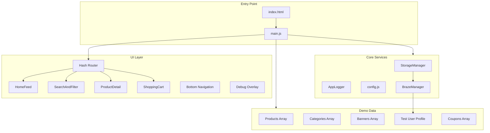

# UniqueItemMarketplace SPA — Implementation Plan

## Current State

The `app/` directory is empty (greenfield). Only `.cursor/` configuration exists. Everything will be built from scratch following [design.json](.cursor/design/design.json), [PROJECT_SPECS.mdc](.cursor/rules/PROJECT_SPECS.mdc), and all `.cursor/rules/`.

---

## Architecture




---

## File Structure

```
app/
├── index.html              # Shell: phone frame, head tags, script loading
├── package.json            # Tailwind + dev dependencies
├── tailwind.config.js      # Design tokens from design.json
├── vercel.json             # SPA rewrites
├── .gitignore
├── README.md
├── css/
│   └── styles.css          # Tailwind directives + iPhone frame + custom CSS
├── js/
│   ├── config.js           # Braze API key, endpoint, app metadata
│   ├── main.js             # Orchestrator: init services, router, render
│   ├── storage-manager.js  # ar_app_ prefixed localStorage singleton
│   ├── app-logger.js       # Centralized logger with getLogs()
│   ├── braze-manager.js    # SDK init, subscriptions, event helpers
│   ├── router.js           # Hash-based SPA router
│   ├── demo-data.js        # All demo content objects
│   ├── components/
│   │   ├── bottom-nav.js   # 5-tab navigation
│   │   ├── header.js       # Home header + sub-page header
│   │   ├── product-card.js # Reusable card with badges, price
│   │   ├── category-icon.js# Circle icon + label
│   │   ├── promo-carousel.js # Banner carousel (16:7)
│   │   └── debug-overlay.js# External debug panel
│   └── screens/
│       ├── home-feed.js    # Carousel + categories + filters + grid
│       ├── search-filter.js# Search bar + chips + grid
│       ├── product-detail.js# Gallery + price + seller + sticky CTA
│       └── shopping-cart.js # Cart items + coupon + total + checkout
```

---

## Design Token Mapping

From [design.json](.cursor/design/design.json) into CSS `:root` variables:

- `--color-primary: #C62828` (red brand)
- `--color-secondary: #F8F8F8`
- `--color-text-main: #333333`
- `--color-text-muted: #888888`
- `--color-accent-discount: #FF5252`
- `--color-border: #EEEEEE`
- `--spacing-base: 8px`, `--container-padding: 16px`, `--card-gap: 12px`
- `--radius-small: 4px`, `--radius-medium: 8px`, `--radius-large: 12px`, `--radius-round: 50%`
- iPhone frame vars: `--phone-w: 390px`, `--phone-h: 844px`, `--safe-t: 47px`, `--safe-b: 34px`

Tailwind config will extend these colors and spacing values for utility class usage.

---

## Core Services

**StorageManager** — Singleton with `ar_app_` prefix, `set/get/remove/clearSession` methods. Keys: `user_session`, `current_route`, `cart`, `coupons_applied`, `braze_init_status`, `debug_mode`.

**AppLogger** — Singleton with `info/debug/warn/error` methods, CSS-styled console output, `getLogs()` for debug overlay. ERROR logs fire Braze custom event `App_Error`.

**BrazeManager** — Wraps all SDK calls in `if (window.braze)`. Handles init, `changeUser()`, IAM subscription (render inside `#phone-frame`), Content Cards subscription (map to carousel), and event logging helpers. Test user loaded from demo data on app start.

**Router** — Hash-based (`#/`, `#/store`, `#/search`, `#/product/:id`, `#/cart`, `#/coupons`, `#/profile`). Updates bottom nav active state. Logs `Navigation - Tab Switched` to Braze.

---

## Screens (from design.json)

**HomeFeed (`#/`):** PromoBannerCarousel (16:7 aspect) -> CategoryGrid (2x4) -> FilterTabs (Hot Deals / New Arrivals / Rare Items) -> ProductGrid (two-column). Home header with logo + search icon.

**SearchAndFilter (`#/search`):** SearchBar ("Search items...") -> horizontal FilterChips -> ProductGrid. Sub-page header with back + title.

**ProductDetail (`#/product/:id`):** ImageGallery (numeric pagination) -> PriceTag (original + discount) -> SellerContactCard (Call, LineChat, ViewStore) -> DescriptionText -> BottomStickyAction (Back + AddToCart red). Sub-page header.

**ShoppingCart (`#/cart`):** CartItemList (unique items) -> CouponSelector (row entry) -> TotalSummary (Discount, GrandTotal) -> CheckoutButton (full-width red). Sub-page header.

---

## Bottom Navigation (5 tabs)

- Home: `fa-house` -> `#/`
- Store: `fa-store` -> `#/store` (default active per design.json)
- Coupons: `fa-ticket` -> `#/coupons`
- Cart: `fa-cart-shopping` -> `#/cart` (numeric badge from cart count)
- Profile: `fa-circle-user` -> `#/profile`

Active color: `--color-primary` (#C62828). Inactive: `#8E8E93`. Height: `56px + var(--safe-b)`. Glassmorphism blur background.

---

## Demo Data (no static markup)

All UI content rendered dynamically from `demo-data.js`:

- **8 products** with id, title, price, originalPrice, discount%, grade (A/B/S), status (Hot/New/Rare), thumbnail URL, seller info, description
- **8 categories** for the 2x4 grid (e.g., Electronics, Fashion, Collectibles, etc.) with icon URLs and labels
- **3 promo banners** for the carousel with image URLs and CTA text
- **3 coupons** with code, description, discount amount
- **1 test user** `{ external_id, name, email }` for Braze `changeUser()`

---

## Header Actions

- **Debug link** — Opens the Debug Overlay (rendered outside `#phone-frame`). Shows: current user profile (External ID, Braze ID, contact info) + last 20 events from AppLogger.
- **Reset link** — Calls `StorageManager.clearSession()`, resets route to `#/`, reloads app to initial demo state.

---

## Braze Events Tracked

- `Navigation - Tab Switched` (properties: `tab_name`)
- `Promotion - Viewed` (properties: `banner_id`, `banner_title`)
- `Product - Viewed` (properties: `product_id`, `product_title`, `price`)
- `Cart - Item Added` (properties: `product_id`, `product_title`, `price`)
- `Cart - Item Removed` (properties: `product_id`)
- `Coupon - Applied` (properties: `coupon_code`, `discount`)
- `Checkout - Started` (properties: `total`, `item_count`)
- `App_Error` (from AppLogger ERROR level)

---

## Implementation Order

10 sequential phases, building bottom-up from infrastructure to UI.